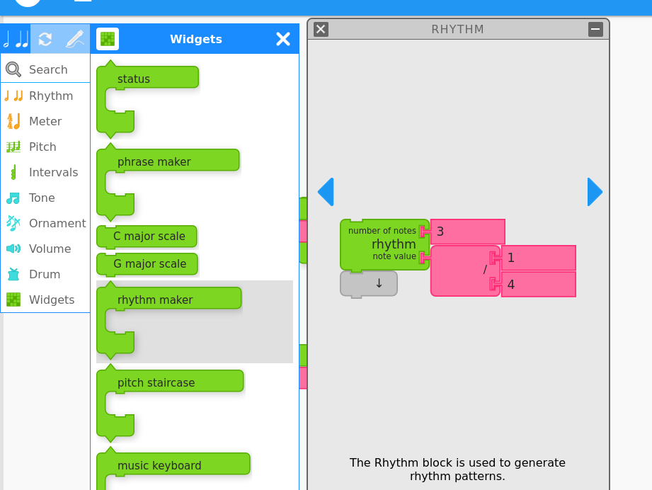

# Product Requirements Document (PRD): Masonry Framework

## 1. Bricks

### a. Brick Types

#### 1. Data Bricks: These represent simple data values, such as numbers or strings, and serve as inputs for other bricks.
   - Number Data Brick (representing note values, durations, etc.)

     
   - String Data Brick (representing note names, pitches, etc.)

     

#### 2. Expression Bricks: These perform logical or mathematical operations.
   - Equal Expression Brick
   - Not Equal Expression Brick
   - Greater Than Expression Brick
   - Less Than Expression Brick
   - And Expression Brick
   - Or Expression Brick
   - Not Expression Brick
   - Random Expression Brick
   - Length Expression Brick
   - Letter Expression Brick
   - Number Expression Brick

     

#### 3. Statement Bricks: These define actions to be taken.
   - Play Note Statement Brick
   - Rest Statement Brick
   - Set Instrument Statement Brick
   - Increase Volume Statement Brick
   - Decrease Volume Statement Brick
   - Set Tempo Statement Brick
   - Set Key Statement Brick
   - Set Mode Statement Brick
   - Start Drum Statement Brick
   - Start Chord Statement Brick

     

#### 4. Brick Bricks:
   - Repeat Brick
   - Forever Brick
   - If Brick
   - If-Else Brick
   - Action Brick
   - Start Brick
   - Clamp Brick
   - Store In Brick
   - Box Brick
   - Pitch Brick
   - Rhythm Brick
   - Meter Brick (representing time signatures)
   - Volume Brick
   - Articulation Brick
   - Pitch-Time Matrix Brick

### b. Brick Appearance
   - **Distinct Shapes**: Each brick type has a unique shape to differentiate its function visually.
   - **Colors**: Color-coding helps users quickly identify the type of brick.
   - **Icons and Labels**: Visual symbols and text labels indicate the brick's function.
   - **Input/Output Ports**: Connectors visually represent where bricks can attach to each other.
   - **Editable Text Labels/Fields**: Users can input data directly into the bricks, such as note names, durations, and numerical values.

### c. Brick Interactions
   - **Inline Text Editing**: Users can click on text fields within bricks to edit labels and values directly.
   
   - **Drop-Down Menus/Selectors**: For choosing predefined options, enhancing ease of use.
   - **Dedicated Editors/Dialogs**: For more complex properties, a separate interface allows detailed configuration.
   
   - **Resizing and Rotation**: Bricks can be resized and rotated to fit the workspace better.
   - **Cloning/Duplication**: Users can easily create copies of bricks for repeated use.
   - **Context Menus**: Right-click options for advanced customization and settings.

## 2. Stack of Bricks

### a. Stack Validation:
   - **Visual Feedback**: Indicators show whether brick combinations are valid.

      
   - **Error Indicators**: Explanations for incompatible connections help users troubleshoot.
        - Add a reddish boundary for users to easily tell whether the bricks are mergeable or not.  
    

   - **Disable Validation**: Temporarily turn off validation for complex or experimental setups.

### b. Stack Editing:
   - **Connection Editing**: Options for rerouting, splitting, or merging connections.
   - **Quick Edit Shortcuts**: Context menus or keyboard shortcuts speed up editing.
   - **Undo/Redo**: Users can revert or reapply changes to their stacks.

### c. Stack Grouping:
   - **Grouping Bricks**: Multiple bricks or connections can be grouped for better organization.
   
   - **Visual Boundaries**: Outlines or boundaries define groups clearly.
   - **Collapsible Groups**: Groups can be collapsed or expanded to manage complexity.

     

## 3. Palette:
   - **Layout and Organization**:
     - Collapsible/expandable categories or sections for different Brick types
     - Customizable order and arrangement of categories
     - Visual separators or dividers between categories

         

   - **Brick Previews**:
     - Thumbnail or icon previews for each Brick within a category
     - Tooltips or pop-ups displaying Brick names and brief descriptions
     - Color-coding or visual cues for distinguishing different Brick types

   - **Search and Filtering**:
     - Search bar or input field for locating specific Bricks by name or keyword
     - Filter options for narrowing down Bricks based on category, type, or properties
     - Live search results or suggestions as the user types

       

   - **Drag and Drop**:
     - Ability to drag and drop Bricks from the palette onto the workspace
     - Visual indicators (e.g., ghost preview, outline) for valid drop locations
     - Snap-to-grid or precise positioning when dropping Bricks

        

   - **Brick Creation**:
     - Options for creating new Bricks or Brick instances directly from the palette
     - Context menus or shortcuts for duplicating or cloning existing Bricks
     - Visual feedback or animations when creating or instantiating new Bricks

   - **Customization**:
     - User-defined categories or custom groupings for organizing Bricks
     - Ability to rename, reorder, or hide/show specific categories
     - Import/export functionality for sharing or backing up custom palette configurations

   - **Palette Behavior**:
     - Dockable or floating palette panel for flexible positioning
     - Resizable palette window or panel for adjusting its size
     - Auto-hide or collapse functionality for maximizing workspace area

## 4. Workspace:

### a. Canvas Area:
   - **Grid-Like Surface**: A grid helps in arranging bricks and stacks.
   - **Staff Lines/Notation**: Visual representation of musical notation on the canvas.
   - **Connection Indicators**: Visual cues for valid/invalid connections.

### b. Navigation and Viewing:
   - **Panning/Scrolling**: Navigate large compositions easily.
   - **Zoom Controls**: Adjust the workspace scale for detailed or broad views.
   - **Minimap/Overview**: A bird's-eye view of the entire composition for quick navigation.

### c. Musical Notation Rendering:
   - **Traditional Notation**: Render staff, notes, rests, etc., based on the brick composition.
   - **Real-Time Updates**: Notation updates as bricks are added, removed, or modified.
   - **Notation Styles**: Switch between staff, piano roll, guitar tablature, etc.
   - **Synchronized Highlighting**: Highlight or animate notation during audio playback.

### d. Audio Playback and Visualization:
   - **Playback Controls**: Play, pause, stop, and seek with visual feedback.
   - **Synchronized Visualizations**: Piano roll, waveform, and other visualizations during playback.
   - **Instrument Icons**: Select different instrument sounds visually.

### e. Workspace Customization:
   - **Toggle Visual Aids**: Options to show or hide grid lines, staff lines, and other aids.
   - **Background Themes**: Change the workspace background color or theme.
   - **Save/Load Layouts**: Save and load workspace layouts or configurations.

