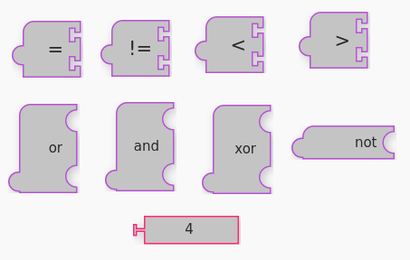
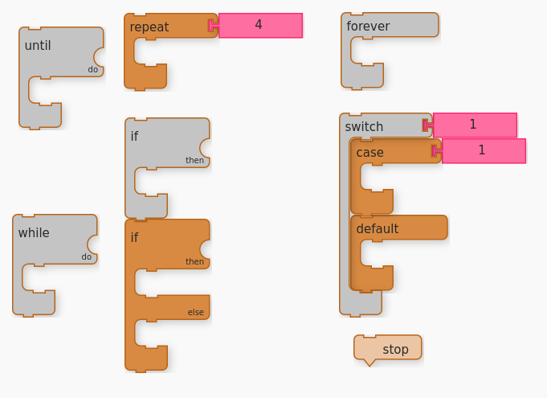
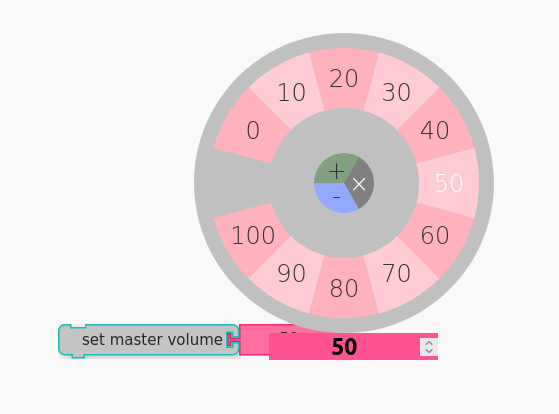
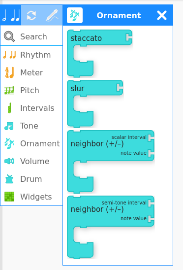
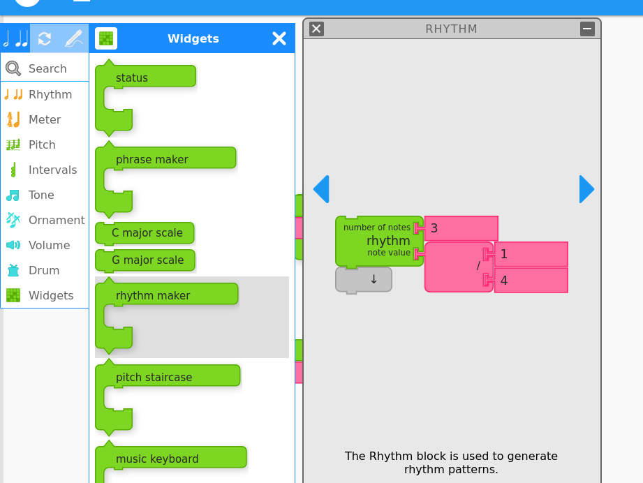
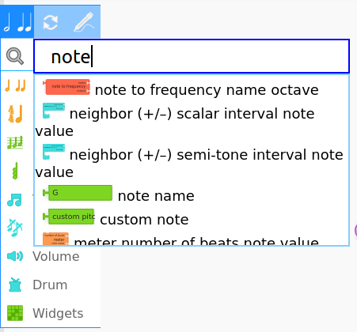

# Product Requirements Document (PRD): Masonry Framework

## 1. Bricks

### a. Brick Types

#### 1.Data Bricks: These serve as inputs for other bricks and come in two types

#### hardcoded and editable

- Hardcoded Data Brick: Fixed values that cannot be changed by the user. Examples include predefined
 note values, counts, etc.

     
- Editable Data Brick: Values that can be modified by the user. When clicked, these bricks open a
text editor or a dropdown menu for user input, allowing customization of note names, pitches, etc.

     

#### 2. Expression Bricks: Takes values as input, returns a value as output

   

#### 3. Statement Bricks: These define actions to be taken

   

#### 4. Block Bricks: Contain nesting, also execute something like the statement

#### bricks. Takes 0 or more arguments

   

### b. Brick Appearance

- **Distinct Shapes**: Each brick type has a unique shape to differentiate its function visually.
- **Colors**:
     1. **Original Color**: Each brick has a unique color that represents its type.
     2. **Hover Color**: When a user hovers over a brick, it changes to a distinct color to indicate
      it is selectable.
     3. **Disconnected Color**: If a brick is not connected to the stack, it turns gray to indicate
      it is inactive.
     4. **Execution Color**: When a brick is executed, it changes to a darker shade of its original
      color to show that it has been activated.
- **Sprites**: Visual symbols that indicate specific functions or properties of the brick. Some
bricks may have sprites (like the start brick), while others may not.
- **Labels**:
     1. **Functionality Labels**: Text labels that indicate the function of the brick.
     2. **Argument Labels**: Text labels that indicate the arguments or parameters that need to be
     provided for the brick's function.
- **Input/Output Ports**: Connectors that visually represent where bricks can attach to each other.
- **Editable Text Labels/Fields**: Users can input data directly into the bricks, such as note names,
 durations, and numerical values.

   **Side Note:** If we want to implement a design similar to Scratch in the future, we can consider
the following approach for connecting blocks:

- In Scratch, blocks are connected horizontally in a row for sequential execution. Each block has a
tab at the bottom and a notch at the top, allowing them to snap together in a linear sequence. This
design makes it clear which blocks will execute in order.

### c. Brick Interactions

- **Inline Text Editing**: Users can click on text fields within bricks to edit labels and values directly.
  - Some bricks only open an inline text editor when clicked.

       

  - Other bricks open both an inline text editor and a context menu for additional options.

       
- **Context Menus**: For more complex properties, a separate interface allows detailed configuration.

     
- **Connection Types**:
     1. **Argument Connections**: Bricks can be connected to input arguments of other bricks. This
     allows for passing data or parameters into the brick’s function.
     2. **Brick-to-Brick or Stack Connections**: Bricks can be connected directly to other bricks or
      to a stack of bricks. This enables building complex sequences and structures by chainingbricks
       together.

        

## 2. Stack of Bricks

### a. Stack Validation

- **Visual Feedback**: Indicators show whether brick combinations are valid.

- **Error Indicators**: Explanations for incompatible connections help users troubleshoot.
  - Add a reddish boundary for users to easily tell whether the bricks are mergeable or not.  

   

- **Disable Validation**: Temporarily turn off validation for complex or experimental setups.

      **Note** - this is up for further discussion

### b. Stack Editing

- **Connection Editing**: Options for re-positioning, disconnecting, or connecting.
- **Quick Edit Shortcuts**: Context menus or keyboard shortcuts speed up editing.

### c. Stack Grouping

- **Collapsible Groups**: Groups can be collapsed or expanded to manage complexity.

     

## 3. Palette

### a. **Layout and Organization**

- Collapsible/expandable categories or sections for different Brick types
- Visual separators or dividers between categories
- Customizable order and arrangement of categories

     

### b. **Brick Previews**

- Tooltips or pop-ups displaying Brick names and brief descriptions

   

- Color-coding or visual cues for distinguishing different Brick types

### c. **Search and Filtering**

- Search bar or input field for locating specific Bricks by name or keyword
- Filter options for narrowing down Bricks based on category, type, or properties
- Live search results or suggestions as the user types
  - Searchbar in Musicblocks as of now:

      

  - Searchbar design to be implemented:

      
          The idea here is to have a fixed searchbar on the left side of the workspace through which
           users can search for bricks, group them etc.
          Note - It is just a one big list and categories on the left are positions on the list.

### d. **Drag and Drop**

- Ability to drag and drop Bricks from the palette onto the workspace.
- Visual indicators (e.g., ghost preview, outline) for valid drop locations.

     

  - While dragging a brick from the palette, the brick should temporarily disappear from the palette
   until it is placed in the workspace.

## 4. Workspace

- **Cloning/Duplication**: Users can easily create copies of bricks for repeated use.
- **Scaling and Rotation**: Bricks can be resized and rotated to fit the workspace better.
- **Undo/Redo**: Users can revert or reapply changes to their stacks.
- **Removal/Deletion of Bricks** : Users can remove/delete bricks
